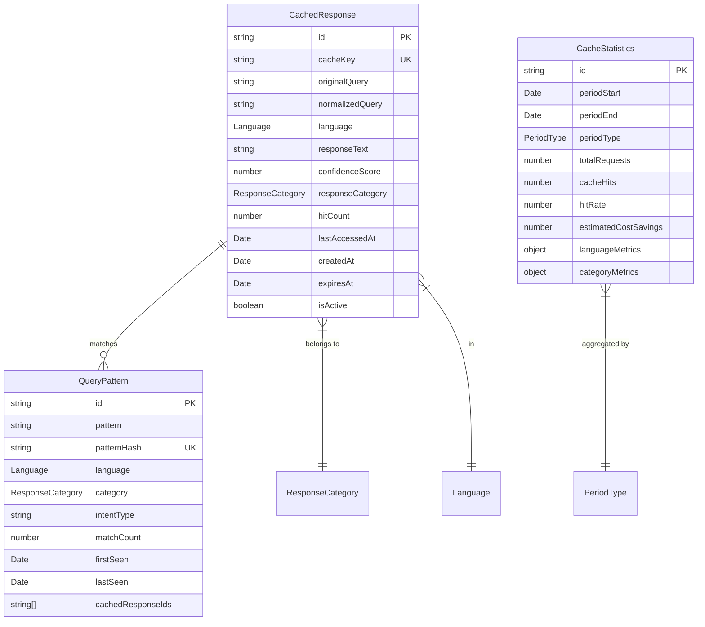

# Data Model: AI Cache System

**Branch**: `001-ai-cache-system` | **Date**: 2025-11-01
**Feature**: [AI Cache System](./spec.md)

## Entity Definitions

### CachedResponse

Represents a stored AI response with associated metadata for cache management.

```typescript
interface CachedResponse {
  // Primary identifier
  id: string;                    // UUID v4

  // Cache key and query information
  cacheKey: string;               // SHA256 hash of normalized query
  originalQuery: string;          // Original customer query (for debugging)
  normalizedQuery: string;        // Normalized version of query
  language: Language;             // Enum: 'ru' | 'en' | 'es' | 'pt' | 'he'

  // Response data
  responseText: string;           // The cached AI response
  responseMetadata?: object;      // Optional metadata (e.g., formatting hints)

  // Quality and scoring
  confidenceScore: number;        // 0.0 to 1.0, minimum 0.7 for caching
  responseCategory: ResponseCategory; // Category for TTL rules

  // Usage tracking
  hitCount: number;               // Number of times served from cache
  lastAccessedAt: Date;           // Last time this cache entry was used

  // Lifecycle management
  createdAt: Date;                // When cached
  expiresAt: Date | null;        // When expires (null = no expiration)
  isActive: boolean;              // Soft delete flag

  // Performance metrics
  originalResponseTime: number;   // Original AI response time in ms
  averageCacheResponseTime: number; // Average cache retrieval time
}
```

### QueryPattern

Represents a normalized query format for matching similar customer inputs.

```typescript
interface QueryPattern {
  // Primary identifier
  id: string;                    // UUID v4

  // Pattern information
  pattern: string;                // Normalized pattern
  patternHash: string;           // SHA256 hash for fast lookup
  language: Language;            // Language this pattern applies to

  // Classification
  category: ResponseCategory;    // Determines TTL and handling
  intentType: string;            // Maps to AI intent classification

  // Statistics
  matchCount: number;            // Times this pattern matched
  firstSeen: Date;               // When first encountered
  lastSeen: Date;                // Most recent match

  // Relationships
  cachedResponseIds: string[];   // References to CachedResponse entries
}
```

### CacheStatistics

Aggregated metrics for monitoring and analytics.

```typescript
interface CacheStatistics {
  // Time window
  id: string;                    // UUID v4
  periodStart: Date;             // Start of measurement period
  periodEnd: Date;               // End of measurement period
  periodType: PeriodType;        // 'hourly' | 'daily' | 'weekly' | 'monthly'

  // Performance metrics
  totalRequests: number;         // Total queries received
  cacheHits: number;             // Queries served from cache
  cacheMisses: number;           // Queries requiring AI call
  hitRate: number;               // Calculated hit percentage

  // Cost metrics
  estimatedCostSavings: number;  // USD saved by cache hits
  aiApiCallsCost: number;        // Cost of cache misses
  totalCostWithoutCache: number; // Hypothetical cost without caching

  // Response time metrics
  avgCacheResponseTime: number;  // Average ms for cache hits
  avgAiResponseTime: number;     // Average ms for AI calls
  p95CacheResponseTime: number;  // 95th percentile cache response
  p99CacheResponseTime: number;  // 99th percentile cache response

  // Storage metrics
  totalCacheEntries: number;     // Number of cached responses
  totalCacheSize: number;        // Size in bytes
  activeEntries: number;         // Non-expired entries

  // Language breakdown
  languageMetrics: {
    [key in Language]: {
      requests: number;
      hits: number;
      hitRate: number;
    };
  };

  // Category breakdown
  categoryMetrics: {
    [key in ResponseCategory]: {
      requests: number;
      hits: number;
      avgResponseTime: number;
    };
  };
}
```

### ResponseCategory

Enum defining response categories for TTL and handling rules.

```typescript
enum ResponseCategory {
  GREETING = 'greeting',           // No expiration
  PRICING = 'pricing',            // 7 days TTL
  AVAILABILITY = 'availability',  // 1 hour TTL
  SERVICES = 'services',          // 30 days TTL
  HOURS = 'hours',                // 7 days TTL
  LOCATION = 'location',          // 30 days TTL
  BOOKING = 'booking',            // 1 hour TTL
  GENERAL = 'general'             // 24 hours TTL (default)
}
```

### Language

Enum for supported languages.

```typescript
enum Language {
  RUSSIAN = 'ru',
  ENGLISH = 'en',
  SPANISH = 'es',
  PORTUGUESE = 'pt',
  HEBREW = 'he'
}
```

### PeriodType

Enum for statistics aggregation periods.

```typescript
enum PeriodType {
  HOURLY = 'hourly',
  DAILY = 'daily',
  WEEKLY = 'weekly',
  MONTHLY = 'monthly'
}
```

## Relationships

### Entity Relationship Diagram



## Validation Rules

### CachedResponse Validation

- `confidenceScore` must be between 0.0 and 1.0
- `confidenceScore` must be >= 0.7 to create cache entry
- `responseText` must not be empty
- `cacheKey` must be valid SHA256 hash (64 characters)
- `language` must be valid Language enum value
- `expiresAt` must be future date or null
- `hitCount` must be >= 0

### QueryPattern Validation

- `patternHash` must be valid SHA256 hash
- `pattern` must not be empty
- `matchCount` must be >= 0
- `lastSeen` must be >= `firstSeen`

### CacheStatistics Validation

- `periodEnd` must be after `periodStart`
- `hitRate` must be between 0 and 100
- `cacheHits` + `cacheMisses` must equal `totalRequests`
- All metrics must be >= 0

## State Transitions

### CachedResponse Lifecycle

```
Created (confidenceScore >= 0.7)
    ↓
Active (isActive = true, expiresAt > now)
    ↓
Accessed (hitCount++, lastAccessedAt = now)
    ↓
[One of:]
    → Expired (expiresAt <= now) → Deleted
    → Low Value (hitCount < 2 after 30 days) → Deleted
    → Low Quality (confidenceScore < 0.5) → Deleted
```

### Cache Operation Flow

```
Query Received
    ↓
Normalize Query
    ↓
Generate Cache Key
    ↓
Cache Lookup
    ↓
[Cache Hit?]
    → Yes: Increment hitCount, Update lastAccessedAt, Return cached response
    → No: Call AI Service
        ↓
    [Confidence >= 0.7?]
        → Yes: Create CachedResponse, Store in cache
        → No: Return response without caching
```

## Indexing Strategy

### Primary Indexes
- `CachedResponse.cacheKey` - Unique index for O(1) lookups
- `QueryPattern.patternHash` - Unique index for pattern matching

### Secondary Indexes
- `CachedResponse.language` + `CachedResponse.responseCategory` - Compound index for analytics
- `CachedResponse.expiresAt` - For cleanup operations
- `CachedResponse.lastAccessedAt` + `CachedResponse.hitCount` - For pruning low-value entries
- `CacheStatistics.periodType` + `CacheStatistics.periodStart` - For time-based queries

## Data Retention

### Retention Policies

- **CachedResponse**:
  - Greetings: No expiration
  - Pricing: 7 days
  - Availability: 1 hour
  - Services: 30 days
  - General: 24 hours
  - Low-value entries: Deleted after 30 days if < 2 hits

- **QueryPattern**:
  - Retained indefinitely for pattern analysis
  - Archived after 90 days of no matches

- **CacheStatistics**:
  - Hourly: 7 days
  - Daily: 30 days
  - Weekly: 90 days
  - Monthly: 1 year

## Migration Considerations

### Initial Schema Creation

```sql
-- Cache analytics table for PostgreSQL
CREATE TABLE cache_statistics (
    id UUID PRIMARY KEY DEFAULT gen_random_uuid(),
    period_start TIMESTAMP NOT NULL,
    period_end TIMESTAMP NOT NULL,
    period_type VARCHAR(10) NOT NULL,
    total_requests INTEGER DEFAULT 0,
    cache_hits INTEGER DEFAULT 0,
    cache_misses INTEGER DEFAULT 0,
    hit_rate DECIMAL(5,2) DEFAULT 0,
    estimated_cost_savings DECIMAL(10,2) DEFAULT 0,
    language_metrics JSONB,
    category_metrics JSONB,
    created_at TIMESTAMP DEFAULT NOW(),
    INDEX idx_period (period_type, period_start)
);
```

Note: CachedResponse and QueryPattern entities are stored in Redis, not PostgreSQL, for optimal performance.