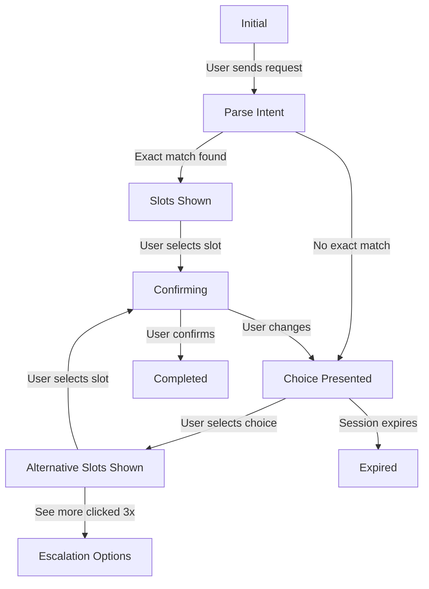

# Data Model: Empathetic AI Dialog Enhancement

**Feature**: 002-empathetic-ai-dialog
**Date**: 2025-10-31
**Version**: 1.0.0

## Overview

This document defines the data models, TypeScript interfaces, and database schemas for the empathetic dialog enhancement feature. All entities are designed to integrate seamlessly with the existing WhatsApp booking system.

---

## 1. Core Entities

### 1.1 Choice Option

Represents a categorical choice presented to the user when their exact request cannot be fulfilled.

```typescript
/**
 * Categorical choice option for decision navigation
 */
export interface ChoiceOption {
  /** Unique identifier for the choice */
  id: 'same_day_diff_time' | 'diff_day_same_time' | 'popular_times' | 'see_more';

  /** Localized display label */
  label: string;

  /** Visual indicator emoji */
  emoji: string;

  /** Optional detailed description */
  description?: string;

  /** Button type for WhatsApp */
  buttonType: 'reply' | 'list_item';

  /** Analytics tracking */
  analyticsKey?: string;
}

// Example instance
const sameDeviceChoice: ChoiceOption = {
  id: 'same_day_diff_time',
  label: 'Пятница, но другое время',
  emoji: '✅',
  description: 'Показать свободные слоты на пятницу',
  buttonType: 'reply',
  analyticsKey: 'choice_same_day'
};
```

### 1.2 Booking Context

Maintains conversation state across multiple interactions.

```typescript
/**
 * Session context for maintaining conversation state
 */
export interface BookingContext {
  /** Unique session identifier */
  sessionId: string;

  /** WhatsApp customer phone number */
  customerId: string;

  /** Associated salon */
  salonId: string;

  /** Original booking intent from first message */
  originalIntent: {
    service?: string;
    serviceId?: string;
    date?: string;
    time?: string;
    masterId?: string;
    masterName?: string;
    confidence: number;
  };

  /** Detected language */
  language: 'ru' | 'en' | 'es' | 'pt' | 'he';

  /** Choice navigation history */
  choices: Array<{
    choiceId: string;
    selectedAt: Date;
    resultShown: boolean;
  }>;

  /** Conversation metadata */
  metadata: {
    messageCount: number;
    buttonClickCount: number;
    typedMessageCount: number;
    lastInteraction: Date;
  };

  /** Session timestamps */
  createdAt: Date;
  expiresAt: Date;

  /** Current conversation state */
  state: 'initial' | 'choice_presented' | 'slots_shown' | 'confirming' | 'completed';
}
```

### 1.3 Empathy Message

Template for empathetic messages with emotion indicators.

```typescript
/**
 * Multi-language empathetic message template
 */
export interface EmpathyMessage {
  /** Unique message key */
  key: string;

  /** Message variants by language */
  templates: {
    ru: string;
    en: string;
    es: string;
    pt: string;
    he: string;
  };

  /** Emotional tone */
  emotion: 'happy' | 'sad' | 'neutral' | 'excited' | 'empathetic';

  /** Associated emoji */
  emoji: string;

  /** Variable placeholders */
  parameters?: string[];

  /** Maximum line count */
  maxLines: number;

  /** Business type variations */
  variations?: {
    beauty_salon?: string;
    barbershop?: string;
    spa?: string;
  };
}

// Message template constant
export const MESSAGE_TEMPLATES: Record<string, EmpathyMessage> = {
  SLOT_TAKEN: {
    key: 'SLOT_TAKEN',
    templates: {
      ru: 'К сожалению, {time} в {day} уже занято 😔\n\nНо не переживайте! Я нашёл отличные варианты 🎯\n\nЧто вам удобнее?',
      en: 'Unfortunately, {time} on {day} is already booked 😔\n\nBut don\'t worry! I found great options 🎯\n\nWhat works better for you?',
      es: 'Desafortunadamente, {time} el {day} ya está reservado 😔\n\n¡Pero no te preocupes! Encontré excelentes opciones 🎯\n\n¿Qué te conviene más?',
      pt: 'Infelizmente, {time} em {day} já está reservado 😔\n\nMas não se preocupe! Encontrei ótimas opções 🎯\n\nO que funciona melhor para você?',
      he: 'לצערנו, {time} ב{day} כבר תפוס 😔\n\nאבל אל דאגה! מצאתי אפשרויות מעולות 🎯\n\nמה מתאים לך יותר?'
    },
    emotion: 'empathetic',
    emoji: '😔',
    parameters: ['time', 'day'],
    maxLines: 3
  }
};
```

### 1.4 Popular Time Slot

Historical booking pattern analysis result.

```typescript
/**
 * Popular booking time based on historical data
 */
export interface PopularTimeSlot {
  /** Day of week (0=Sunday, 6=Saturday) */
  dayOfWeek: number;

  /** Hour of day (0-23) */
  hour: number;

  /** Display-friendly day name */
  dayName: string;

  /** Display-friendly time format */
  displayTime: string;

  /** Raw booking count */
  bookingCount: number;

  /** Weighted count considering recency */
  weightedScore: number;

  /** Statistical confidence (0-1) */
  confidence: number;

  /** Current availability */
  isAvailable: boolean;

  /** Next available slot if not available */
  nextAvailableSlot?: {
    date: string;
    time: string;
  };

  /** Formatted display text */
  displayText: {
    ru: string;
    en: string;
    es: string;
    pt: string;
    he: string;
  };
}

// Example instance
const popularSlot: PopularTimeSlot = {
  dayOfWeek: 5,
  hour: 15,
  dayName: 'Friday',
  displayTime: '3:00 PM',
  bookingCount: 23,
  weightedScore: 35.5,
  confidence: 0.92,
  isAvailable: true,
  displayText: {
    ru: 'Пятница 15:00 ⭐ 23 брони',
    en: 'Friday 3:00 PM ⭐ 23 bookings',
    es: 'Viernes 15:00 ⭐ 23 reservas',
    pt: 'Sexta 15:00 ⭐ 23 reservas',
    he: 'יום שישי 15:00 ⭐ 23 הזמנות'
  }
};
```

### 1.5 Proximity Score

Metadata for ranking alternatives by proximity.

```typescript
/**
 * Proximity scoring for alternative ranking
 */
export interface ProximityScore {
  /** Original slot being ranked */
  slot: SlotSuggestion;

  /** Proximity metrics */
  scores: {
    /** Time proximity in minutes */
    timeDistance: number;

    /** Date proximity in days */
    dateDistance: number;

    /** Master match (1 if same, 0 if different) */
    masterMatch: number;

    /** Service match (always 1 for same service) */
    serviceMatch: number;
  };

  /** Calculated weights */
  weights: {
    timeWeight: number;    // Based on time proximity
    dateWeight: number;    // Based on date proximity
    masterWeight: number;  // Bonus for same master
  };

  /** Final composite score */
  totalScore: number;

  /** Rank position */
  rank: number;

  /** Visual indicators */
  indicators: {
    showStar: boolean;     // Show ⭐ for top matches
    proximityText?: string; // e.g., "1 hour earlier"
  };
}
```

### 1.6 Choice Card

WhatsApp interactive card specifically for choices.

```typescript
/**
 * Interactive choice card for WhatsApp
 */
export interface ChoiceCard {
  /** Card identifier */
  id: string;

  /** Card type */
  type: 'choice' | 'popular_times' | 'alternatives';

  /** Header message (empathetic explanation) */
  header: {
    text: string;
    emoji?: string;
  };

  /** Body message (context) */
  body: {
    text: string;
    format?: 'plain' | 'bold' | 'italic';
  };

  /** Choice options */
  choices: ChoiceOption[];

  /** Footer text */
  footer?: {
    text: string;
  };

  /** WhatsApp message format */
  whatsappFormat: 'reply_buttons' | 'list_message';

  /** Analytics metadata */
  analytics: {
    scenario: string;
    presentedAt: Date;
  };
}
```

---

## 2. Database Schema (Redis Storage)

### 2.1 Session Context Storage

```typescript
// Redis key pattern
`session:${customerId}:${salonId}`

// Value structure (JSON stringified)
{
  "sessionId": "uuid-v4",
  "customerId": "+1234567890",
  "salonId": "salon-uuid",
  "originalIntent": {...},
  "language": "ru",
  "choices": [...],
  "metadata": {...},
  "createdAt": "2025-10-31T10:00:00Z",
  "expiresAt": "2025-10-31T10:30:00Z",
  "state": "choice_presented"
}

// TTL: 1800 seconds (30 minutes)
// Extension: +900 seconds (15 minutes) on each interaction
// Maximum lifetime: 3600 seconds (1 hour)
```

### 2.2 Popular Times Cache

```typescript
// Redis key pattern
`popular:${salonId}:${serviceId || 'all'}`

// Value structure (JSON stringified)
[
  {
    "dayOfWeek": 5,
    "hour": 15,
    "bookingCount": 23,
    "weightedScore": 35.5,
    "confidence": 0.92
  },
  // ... more slots
]

// TTL: 3600 seconds (1 hour)
// Invalidation: On new booking for salon
// Background refresh: Every 30 minutes for active salons
```

### 2.3 Message Template Cache

```typescript
// In-memory cache (not Redis)
Map<string, string>

// Key format
`${messageKey}:${language}:${paramHash}`

// Example key
"SLOT_TAKEN:ru:7b2274696d65223a2231353a3030222c22646179223a22d09fd18fd182d0bdd0b8d186d0b0227d"

// Value
"К сожалению, 15:00 в пятницу уже занято 😔\n\nНо не переживайте! Я нашёл отличные варианты 🎯"

// No TTL (cleared on service restart)
```

---

## 3. Type Definitions File Structure

```typescript
// Backend/src/modules/ai/types/choice.types.ts

export * from './entities/choice-option.interface';
export * from './entities/booking-context.interface';
export * from './entities/empathy-message.interface';
export * from './entities/popular-time-slot.interface';
export * from './entities/proximity-score.interface';
export * from './entities/choice-card.interface';

// Message template keys enum
export enum MessageKey {
  SLOT_TAKEN = 'SLOT_TAKEN',
  SLOT_AVAILABLE = 'SLOT_AVAILABLE',
  ALL_DAY_BUSY = 'ALL_DAY_BUSY',
  POPULAR_TIMES_INTRO = 'POPULAR_TIMES_INTRO',
  SAME_DAY_DIFF_TIME = 'SAME_DAY_DIFF_TIME',
  DIFF_DAY_SAME_TIME = 'DIFF_DAY_SAME_TIME',
  BOOKING_CONFIRMED = 'BOOKING_CONFIRMED',
  SESSION_EXPIRED = 'SESSION_EXPIRED',
  ERROR_OCCURRED = 'ERROR_OCCURRED'
}

// Emotion enum
export enum Emotion {
  HAPPY = 'happy',
  SAD = 'sad',
  NEUTRAL = 'neutral',
  EXCITED = 'excited',
  EMPATHETIC = 'empathetic'
}

// Supported languages
export enum Language {
  RU = 'ru',
  EN = 'en',
  ES = 'es',
  PT = 'pt',
  HE = 'he'
}

// Conversation states
export enum ConversationState {
  INITIAL = 'initial',
  CHOICE_PRESENTED = 'choice_presented',
  SLOTS_SHOWN = 'slots_shown',
  CONFIRMING = 'confirming',
  COMPLETED = 'completed'
}
```

---

## 4. Validation Rules

### 4.1 Choice Option Validation

```typescript
import { z } from 'zod';

export const ChoiceOptionSchema = z.object({
  id: z.enum(['same_day_diff_time', 'diff_day_same_time', 'popular_times', 'see_more']),
  label: z.string().min(1).max(50),
  emoji: z.string().regex(/^\p{Emoji}$/u),
  description: z.string().max(100).optional(),
  buttonType: z.enum(['reply', 'list_item']),
  analyticsKey: z.string().optional()
});
```

### 4.2 Booking Context Validation

```typescript
export const BookingContextSchema = z.object({
  sessionId: z.string().uuid(),
  customerId: z.string().regex(/^\+\d{10,15}$/),
  salonId: z.string().uuid(),
  language: z.enum(['ru', 'en', 'es', 'pt', 'he']),
  choices: z.array(z.object({
    choiceId: z.string(),
    selectedAt: z.date(),
    resultShown: z.boolean()
  })).max(10), // Limit choice history
  state: z.enum(['initial', 'choice_presented', 'slots_shown', 'confirming', 'completed'])
});
```

### 4.3 Message Parameter Validation

```typescript
export const MessageParametersSchema = z.record(
  z.string(),
  z.union([z.string(), z.number(), z.boolean()])
);

// Validate before interpolation
export function validateMessageParams(
  messageKey: string,
  params: Record<string, any>
): boolean {
  const required = MESSAGE_TEMPLATES[messageKey].parameters || [];
  return required.every(param => params.hasOwnProperty(param));
}
```

---

## 5. State Transitions



---

## 6. Data Migration Strategy

Since this is an enhancement to existing functionality, no database migrations are required. All new data is stored in Redis with automatic expiry.

### Redis Namespace Setup

```bash
# Redis key namespaces
session:*        # Session contexts (30-min TTL)
popular:*        # Popular times cache (1-hour TTL)
```

### Monitoring Keys

```bash
# Count active sessions
redis-cli --scan --pattern "session:*" | wc -l

# Check popular times cache
redis-cli --scan --pattern "popular:*"

# Memory usage
redis-cli INFO memory
```

---

## 7. Performance Considerations

### Memory Footprint

- **Session Context**: ~2KB per active session
- **Popular Times Cache**: ~500 bytes per salon
- **Message Cache**: ~200 bytes per unique message

### Estimated Redis Memory Usage

```
1000 active sessions × 2KB = 2MB
1000 salons × 500B = 500KB
500 cached messages × 200B = 100KB
Total: ~2.6MB Redis memory
```

### Query Performance

| Operation | Complexity | Expected Time |
|-----------|------------|---------------|
| Session Get/Set | O(1) | <10ms |
| Popular Times Query | O(n log n) | <150ms |
| Message Interpolation | O(n) | <5ms |
| Proximity Ranking | O(n log n) | <20ms |

---

## 8. Security Considerations

### Data Privacy

- Customer phone numbers are already encrypted in main database
- Session contexts contain no PII beyond phone number
- Auto-expiry ensures data doesn't persist

### Input Sanitization

- All message parameters sanitized before interpolation
- Choice IDs validated against enum
- Session IDs are UUIDs (no user input)

### Rate Limiting

- Inherit existing rate limiting from parent feature
- Maximum 10 choices stored per session
- Maximum 3 "see more" clicks before escalation

---

## Conclusion

This data model provides a robust foundation for implementing empathetic dialog enhancements while maintaining compatibility with the existing WhatsApp booking system. The use of Redis for session management ensures fast response times, while TypeScript interfaces guarantee type safety throughout the implementation.